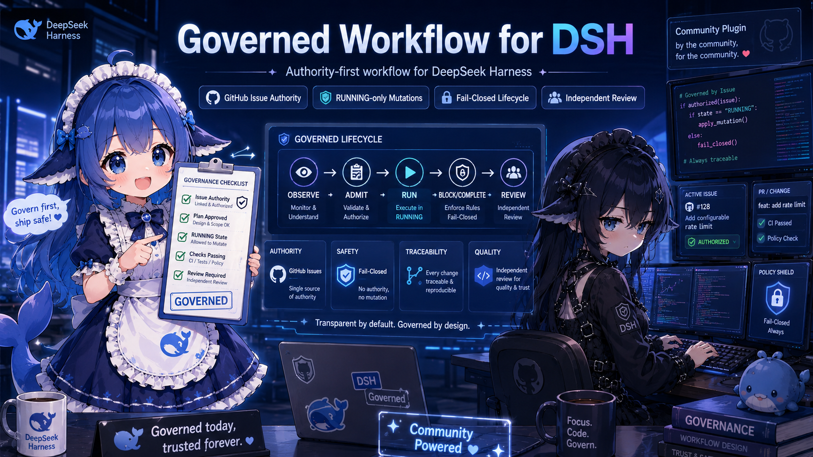

# Governed Workflow for DSH

English | [简体中文](README.zh.md)



> Authority-first governance for DeepSeek Harness coding agents.
>
> **No accepted task authority, no mutation. Independent review stays outside Builder control.**

`dsh-governed-workflow` is an independent community plugin for [DeepSeek Harness](https://github.com/deepseek-ai/deepseek-harness). It brings a GitHub-Issue-governed Builder workflow into the DSH runtime and adds fail-closed lifecycle controls around mutation.

This project is **not affiliated with or endorsed by DeepSeek**.

## What it does

A governed task follows a bounded lifecycle:

```text
GitHub Issue authority
        ↓
     OBSERVE
        ↓
      ADMIT
        ↓
       RUN
        ↓
BLOCK / COMPLETE
        ↓
      REVIEW
```

Core ideas:

- **GitHub Issue Authority** — task scope comes from an explicit authoritative Issue, not stale chat memory or the Builder's own plan.
- **RUNNING-only mutation** — protected mutation tools are denied until accepted authority exists and lifecycle state is exactly `RUNNING`.
- **Fail closed** — missing/malformed authority, illegal lifecycle transitions, and terminal Builder states deny mutation instead of being bypassed.
- **Independent review** — the Builder cannot self-accept, merge, close an accepted task, or create/activate a successor task.
- **Evidence-first** — governance authority and lifecycle transitions are recorded as bounded governance evidence.

## Current status

**V0.9 — Developer Technical Preview**

Implemented today:

- governance lifecycle state machine;
- provider-neutral authority validation and single-snapshot admission;
- opt-in public GitHub Issue authority provider;
- RUNNING-only guard for `bash`, `write`, and `edit`;
- `governance_status` and `governance_transition` model-facing tools;
- `governed-builder` Skill;
- governance evidence recording;
- fail-closed terminal-state mutation freeze.

Verified baseline:

```text
DeepSeek Harness: @deepseek-ai/dsh 0.1.0-rc.6
Node.js: ^22.19.0 || >=24.0.0
Integration: DSH Profile Bundle / harness-profile
Package: dsh-governed-workflow
```

The package is **not published to npm**. OMDSH Workshop submission exists, but independent Workshop review/current-baseline verification/Registry admission remain pending.

## Installation

A reliable end-user installation path is currently being hardened.

The repository contains historical clean-room source-install evidence, but those older commands and pinned SHAs are **not treated as the canonical install command for new users**. We are replacing them with a tested installer / reproducible install instruction before advertising a one-command setup here.

Until that work lands:

- package identity: `dsh-governed-workflow`;
- distribution: public GitHub source, not npm;
- activation model: DSH Profile Bundle;
- do **not** copy old install commands from historical release records as if they were current.

For qualification history only, see [Technical Preview quickstart](docs/technical-preview-quickstart.md) and [OMDSH review evidence](docs/OMDSH_REVIEW.md).

## Public GitHub Issue authority

The optional GitHub provider reads one public, open GitHub Issue and accepts exactly one machine-readable authority block:

```text
<!-- dsh-governed-workflow-authority:v1
{
  "baselineRef": "main",
  "baselineSha": "<40-hex-baseline-SHA>",
  "candidateBranch": "<dedicated-task-branch>",
  "allowedPaths": ["src/**"],
  "protectedBranches": ["main"]
}
-->
```

The provider is opt-in, public-only, unauthenticated, one-shot, and fixed to `https://api.github.com`. The default bundle performs no GitHub request.

`allowedPaths` is currently authority metadata / Builder guidance; it is **not yet hard filesystem containment**.

## Builder lifecycle

Model-facing governance tools:

```text
governance_status
governance_transition
```

Normal flow:

```text
AUTHORITY_OBSERVED
  → ADMIT_TASK
TASK_ADMITTED
  → RUN
RUNNING
  → COMPLETE or BLOCK
COMPLETED / BLOCKED
  → SUBMIT_REVIEW
REVIEW_PENDING
  → stop for independent review
```

There is no Builder-facing `ACCEPTED` action. Acceptance and merge remain outside the Builder runtime surface.

## Hard boundary vs guidance

Hard-enforced at the verified runtime seam:

- accepted authority prerequisite;
- RUNNING-only mutation for `bash` / `write` / `edit`;
- terminal-state mutation freeze;
- lifecycle transition allowlist;
- authority/provider output re-validation and fail-closed admission.

Not hard-enforced today:

- canonical `allowedPaths` filesystem containment;
- Bash/Git semantic parsing;
- protected-branch Git command enforcement;
- GitHub merge/close/successor API enforcement;
- authenticated/private GitHub authority;
- reviewer/owner `ACCEPTED` runtime state;
- containment of arbitrary hostile same-process plugins.

## Default security properties

Without the optional GitHub authority bootstrap, the default bundle:

- performs no network request;
- reads no GitHub token or user credential;
- spawns no subprocess as plugin runtime behavior;
- loads no native code;
- fails closed when no accepted authority exists.

## Development

```sh
pnpm install
pnpm build
pnpm typecheck
pnpm test
```

## Documentation

- [Architecture and trust model](docs/architecture.md)
- [DSH compatibility](docs/dsh-compatibility.md)
- [Technical Preview qualification history](docs/technical-preview-quickstart.md)
- [OMDSH review evidence](docs/OMDSH_REVIEW.md)
- [Security](SECURITY.md)
- [Contributing](CONTRIBUTING.md)
- [Trademark notice](TRADEMARK_NOTICE.md)

## License

[MIT](LICENSE)

---

**Govern first. Ship safe.**
